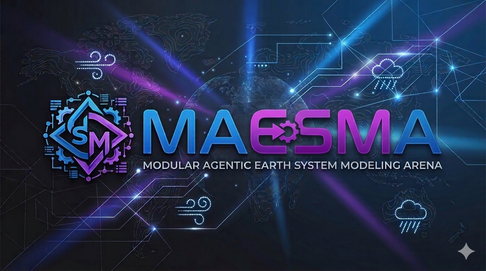

<p align="center">
  
</p>

<h3 align="center">Agentic AI for Autonomous Earth System Observation, Model Discovery, and Simulation</h3>

MAESMA is an agentic AI system that autonomously discovers, assembles, benchmarks, selects, and invents Earth system model configurations. At its center lies a versioned **Process Knowledgebase** — the single store of all process models, manifests, ontological metadata, and skill records. A 25-agent swarm reasons over this knowledgebase via a **neural inference engine** (graph transformer), proposing process selections driven by simulation errors and uncertainties. Process models are treated as **living organisms**: they compete for compute, earn survival through predictive skill, replicate via mutation and crossover, and face extinction when stagnant — an artificial life framework for autonomous model construction.

## Key Ideas

### Autonomy
- **Human-out-of-loop** — Runs autonomously and indefinitely; humans monitor via dashboard, never gate the workflow
- **Infinite loop** — Discover data → query knowledgebase → assemble → benchmark → select → discover processes → deposit → repeat
- **Never idle** — Every simulation advances the posterior; there is always a next hypothesis to test

### Knowledgebase-Centric Design
- **Central Process Knowledgebase** — Single versioned store of all process models (code, manifests, ontologies, skill records); agents query, deposit, and reason over it for all model construction decisions
- **Ontology-indexed** — Unified ontology indexes all knowledgebase contents; every process, dataset, and metric is agent-discoverable upon registration
- **Knowledge compounds** — Every discovered process, every skill record, every observation feeds back into the central store

### Inference and Selection
- **Neural inference engine** — Graph transformer over the knowledgebase proposes process selections from errors, uncertainty, regime context, and compute budgets; replaces hand-crafted heuristics with learned reasoning
- **Salient dynamics first** — Agents prioritize processes with the greatest effect on state evolution; lower-impact detail is added incrementally as budget and accuracy targets demand
- **Error-driven selection** — Every model–observation mismatch reshapes process selection and triggers discovery

### Discovery and Evolution
- **Process discovery** — Residual analysis → learn new representations from observations → validate → deposit into knowledgebase
- **Artificial life** — Processes are living organisms with survival tiers, constitutional invariants, heartbeat monitoring, self-replication, and phylogenetic lineage tracking
- **GPU-accelerated learning** — NVIDIA Modulus neural operators (FNO, PINO, DeepONet, MeshGraphNet) for physics-informed emulation on multi-GPU hardware

### Integrations
- **Foundation models** — NVIDIA Earth-2 (FourCastNet, Pangu-Weather, GraphCast, GenCast) as GPU-accelerated atmosphere rungs
- **Autonomous observation** — PhiSat-2-inspired edge AI for satellite-side anomaly detection, adaptive tasking, and active data acquisition
- **A2A federation** — Inter-institutional agent collaboration and skill sharing via the A2A protocol

### Scope
- **13 process families** — Fire, hydrology, ecology, biogeochemistry, radiation, atmosphere, ocean, cryosphere, human systems, trophic dynamics, evolution, geomorphology, geology
- **Geoengineering control** — 14 intervention types with closed-loop MPC, termination shock analysis, and tipping point avoidance
- **Planetary defense** — All mass extinction drivers modeled and calibrated against 13 historical events spanning 2.4 billion years
- **Full DOE EESM coverage** — ESMD, RGMA, MSD program areas

## Architecture

### Three-Layer Control

```text
┌─────────────────────────────────────────────────────────────────────────┐
│                      STRATEGIC LAYER (hours–weeks)                     │
│                                                                         │
│  Intent & Scope ──► Autonomous Optimizer ──► Model Selection           │
│       │                    │                       │                    │
│       │    ┌───────────────┘                       │                    │
│       ▼    ▼                                       ▼                    │
│  ┌──────────────────────────────────────────────────────────┐           │
│  │           TACTICAL LAYER (minutes–hours)                 │           │
│  │                                                          │           │
│  │  KB Retrieval ──────► Model Assembly ──► Benchmarking  │           │
│  │       │                      │                  │        │           │
│  │  Active Learning ◄───── Closure Check ──── Skill Librarian          │
│  │       │                      │                  │        │           │
│  │  Process Discovery ◄── Data Scout ◄──── EESM Diagnostics│           │
│  └──────────────────────────────────────────────────────────┘           │
│       │                    │                       │                    │
│       ▼                    ▼                       ▼                    │
│  ┌──────────────────────────────────────────────────────────┐           │
│  │            OPERATIONAL LAYER (seconds–minutes)            │           │
│  │                                                          │           │
│  │  Runtime Sentinel ──► Compiler ──► Task Scheduler        │           │
│  │       │                  │              │                 │           │
│  │  Data Plane Agents ◄─── Event Bus ◄─── Device Manager    │           │
│  └──────────────────────────────────────────────────────────┘           │
└─────────────────────────────────────────────────────────────────────────┘
```

All layers run concurrently and continuously. The strategic loop never terminates.

### Knowledgebase-Centric Architecture

```text
┌──────────────────────────────────────────────────────────────────────────┐
│                    KNOWLEDGEBASE-CENTRIC ARCHITECTURE                    │
│                                                                          │
│  Observations ──►  ┌──────────────────────────────┐  ◄── Discovered     │
│  (STAC/CMR/NRT)    │     PROCESS KNOWLEDGEBASE     │      Processes      │
│                     │                              │                     │
│                     │  Process code + manifests    │                     │
│                     │  Ontology graph (5 domains)  │                     │
│                     │  Skill records (append-only) │                     │
│                     │  Learned representations     │                     │
│                     └──────────────┬───────────────┘                     │
│                                    │ query                               │
│                                    ▼                                     │
│                     ┌──────────────────────────────┐                     │
│                     │    NEURAL INFERENCE ENGINE    │                     │
│                     │                              │                     │
│                     │  Graph transformer over KB   │                     │
│                     │  Inputs: errors, uncertainty,│                     │
│                     │    regime context, budgets   │                     │
│                     │  Output: process selections, │                     │
│                     │    assembly proposals        │                     │
│                     └──────────────┬───────────────┘                     │
│                                    │ proposals                           │
│                                    ▼                                     │
│  ┌─────────────┐    ┌──────────────────────────────┐    ┌─────────────┐ │
│  │   PROCESS   │◄───┤       AGENT SWARM (25)       ├───►│  SIMULATION │ │
│  │  DISCOVERY  │    │                              │    │   RUNTIME   │ │
│  │  PIPELINE   │    │  Assemble, compile, execute, │    │             │ │
│  │             │    │  benchmark, score, calibrate  │    │  Multi-GPU  │ │
│  │  Residual → │    └──────────────────────────────┘    │  execution  │ │
│  │  Learn →    │                                        └──────┬──────┘ │
│  │  Validate → │                                               │        │
│  │  Deposit    │    ┌──────────────────────────────┐           │        │
│  │  into KB    │◄───┤    ERRORS & UNCERTAINTIES     │◄──────────┘        │
│  └─────────────┘    │  (drive next inference cycle) │                    │
│                     └──────────────────────────────┘                     │
└──────────────────────────────────────────────────────────────────────────┘
```

The Process Knowledgebase is the gravitational center of the architecture. All agents read from and write to it. The neural inference engine reasons over it to propose process selections. Errors and uncertainties from simulations flow back as the primary signal driving both selection and discovery.

### Autonomous Optimization Loop

```text
┌──────────────────────────────────────────────────────────────────────────────┐
│                    AUTONOMOUS CLOSED LOOP (runs indefinitely)               │
│                                                                              │
│     ┌────────────┐     ┌────────────┐     ┌────────────┐     ┌──────────┐   │
│     │ 1. DISCOVER │────►│ 2. ASSEMBLE│────►│ 3. BENCHMARK────►│ 4. SELECT│   │
│     │    DATA     │     │   MODELS   │     │   & SCORE  │     │  OPTIMAL │   │
│     └─────▲───────┘     └────────────┘     └────────────┘     └────┬─────┘   │
│           │                                                        │         │
│           │         ┌──────────────────────────────────┐            │         │
│           │         │  5. DISCOVER PROCESSES            │◄───────────┘         │
│           │         │     Residual → learn → validate  │                     │
│           │         │     → deposit into Knowledgebase  │                     │
│           │         └──────────────┬───────────────────┘                     │
│           │                        │                                         │
│     ┌─────┴────────────────────────┘                                         │
│     │  6. UPDATE KNOWLEDGEBASE ──► skills + ontology + posteriors            │
│     └──────────────────── repeat forever ────────────────────────────────────┘
│                                                                              │
│  ┌────────────────────────────────────────────────────────────────────────┐  │
│  │  MONITORING PLANE: Next.js dashboard (observe-only, never blocks)     │  │
│  │  Optional: humans adjust objectives/weights/budgets at any time       │  │
│  └────────────────────────────────────────────────────────────────────────┘  │
└──────────────────────────────────────────────────────────────────────────────┘
```

| Step                        | Agent Action                                                    | Ontology Domain |
| --------------------------- | --------------------------------------------------------------- | --------------- |
| **1. Discover Data**        | Crawl catalogs; preprocess; ingest                              | Dataset         |
| **2. Assemble Models**      | Neural inference queries KB; agents build SAPG from proposals   | Process         |
| **3. Benchmark & Score**    | Score against observations; compute multi-metric skill          | Metric          |
| **4. Select Optimal**       | Neural inference + Bayesian selection; update Pareto frontier   | All             |
| **5. Discover Processes**   | Residual analysis → learn new representations from observations | Process+Dataset |
| **6. Update Knowledgebase** | Deposit skill records + learned processes; refine ontology      | All             |

Four concurrent cycles within this loop:

1. **Fitness optimization** — Neural inference proposes per-region, per-regime rung selections from knowledgebase, prioritizing salient dynamics (processes with the greatest effect on system state evolution) first and adding detail incrementally; swap dominant rungs; schedule experiments for uncertain regions
2. **Data discovery** — Gap analysis → catalog search → relevance/novelty scoring → ingest → re-score affected representations
3. **Regime discovery** — Cluster skill records to detect new regime tags, regime boundaries, and regime drift
4. **Process discovery** — Residual analysis on every cycle; structured bias → learn data-driven representation → validate → deposit into knowledgebase → deploy

### Optimization Objective

$$F(\mathbf{r}, g, \ell) = \sum_{m \in \mathcal{M}} w_m \cdot S_m(\mathbf{r}, g, \ell) - \lambda \cdot C(\mathbf{r}) + \gamma \cdot G(\mathbf{r})$$

- $\mathbf{r}$ — rung selections per process family; $g$ — region; $\ell$ — regime
- $S_m$ — skill score for metric $m$; $C$ — cost (FLOPS, memory, walltime); $G$ — generalizability (cross-region transfer)
- $w_m, \lambda, \gamma$ — weights (user-set or learned)

The Autonomous Optimizer maintains a Pareto frontier over skill vs. cost. Optimization operates at three nested scopes:

| Scope                 | What                                        | Timescale    | Agent                |
| --------------------- | ------------------------------------------- | ------------ | -------------------- |
| **Per-region/regime** | Rung selection per context                  | Hours–days   | Autonomous Optimizer |
| **Structural**        | Process family inclusion/coupling decisions | Days–weeks   | Model Selection      |
| **Inventive**         | New representations from data               | Weeks–months | Process Discovery    |

### Scale-Aware Process Graph (SAPG)

Typed, unit-aware, scale-aware directed hypergraph — the substrate agents read, write, compile, and optimize:

- **Nodes** — State variables (e.g., `T_air(x,y,z,t)`, `soil_moisture(layer,t)`)
- **Edges** — Process operators (radiation, infiltration, stomatal conductance, ...)
- **Hyperedges** — Multi-input/output processes
- **Constraints** — Units, bounds, conservation, closure, stability

### Two-Tier Coupling

| Tier     | Timestep       | Processes                                                 |
| -------- | -------------- | --------------------------------------------------------- |
| **Slow** | Days–centuries | Succession, competition, soil C/N, ecohydrology, mgmt     |
| **Fast** | Seconds–hours  | Fire spread, plume feedback, canopy energy, overland flow |

## Process Families

| Family                    | R0 (Regional)                            | R1 (Landscape)                                                    | R2 (Event/Local)                                              | R3 (Research)            |
| ------------------------- | ---------------------------------------- | ----------------------------------------------------------------- | ------------------------------------------------------------- | ------------------------ |
| **Fire**                  | Stochastic regime (km, daily)            | Rothermel + CFS FBP (10–100 m, min)                               | Wind-aware + plume (5–50 m, sec)                              | Fire–atmosphere (m, sec) |
| **Hydrology**             | Bucket + curve-number (km, daily)        | Multi-layer Richards (30–300 m, min)                              | Integrated surface–subsurface (10–100 m, min)                 | —                        |
| **Ecology**               | Cohort mosaic (30–250 m, annual)         | Size-structured cohorts (10–100 m, annual)                        | Individual-based (10–50 m, annual)                            | —                        |
| **Biogeochem**            | Big-leaf C + simple pools                | Multi-pool C/N + litter + microbial (daily)                       | Vertically resolved soil biogeochem                           | —                        |
| **Radiation**             | Daily potential solar + empirical canopy | Sub-daily SW/LW + energy balance (hourly)                         | 3D radiative transfer                                         | —                        |
| **Atmosphere**            | Prescribed (reanalysis)                  | WRF-like downscaling (5–25 km, min)                               | Convection-permitting (1–4 km, sec)                           | E3SM-Omega               |
| **Ocean**                 | Slab mixed-layer (1°, daily)             | z-coordinate regional (0.25°, hourly)                             | Eddy-resolving MPAS-Ocean (1–10 km, min)                      | —                        |
| **Cryosphere**            | Degree-day melt (km, daily)              | Energy-balance snow + sea-ice (30–300 m, hourly)                  | Dynamic ice-sheet + rheology (10 km, min)                     | —                        |
| **Human Systems**         | Exogenous scenarios (national, annual)   | Sectoral demand/supply (regional, monthly)                        | Agent-based infrastructure (county, hourly)                   | Coupled IAM (global)     |
| **Trophic Dynamics**      | Static food web (biome, annual)          | Dynamic Lotka-Volterra (landscape, monthly)                       | Individual-based predator-prey (patch, daily)                 | —                        |
| **Evolution & Phylogeo.** | Fixed traits (PFT, static)               | Adaptive traits + phylogeographic dispersal (population, decadal) | Genotype-phenotype + speciation + gene flow (individual, gen) | —                        |

## Process Knowledgebase

Central versioned store of all process models — the single source of truth that agents query, reason over, and deposit into ([manifest spec](process_registry/README.md)). Every representation in the system lives here, whether hand-coded or discovered from observational data.

Each knowledgebase entry bundles:

| Layer          | Contents                                                                                      |
| -------------- | --------------------------------------------------------------------------------------------- |
| **Code**       | Runnable implementation (CPU solver, GPU kernel, ML emulator) with pluggable backends         |
| **Manifest**   | Machine-readable metadata: identity, I/O contract, scale envelope, conservation, cost model   |
| **Ontology**   | Relations: `compatible_with`, `incompatible_with`, `requires_coupling_with`, regime tags      |
| **Skill**      | Empirical performance per region × regime × season × coupled context (append-only, versioned) |
| **Provenance** | Origin (hand-coded / discovered), training data fingerprint, validation history, lineage      |

### Knowledgebase Operations

| Operation    | Actor                   | Description                                                                  |
| ------------ | ----------------------- | ---------------------------------------------------------------------------- |
| **Query**    | Neural Inference Engine | Retrieve candidates given error signals, regime, scale, budget               |
| **Reason**   | Neural Inference Engine | Score/rank candidates; propose assemblies; identify representation gaps      |
| **Deposit**  | Process Discovery       | Validated learned representations registered with full manifest + provenance |
| **Update**   | Skill Librarian         | Append skill records; refine cost models from runtime measurements           |
| **Federate** | A2A Gateway             | Exchange anonymized skill records and manifests with peers                   |

New entries — whether contributed by humans or discovered from observational data — become immediately available for neural inference, agent selection, and simulation experiments.

## Unified Ontology

The knowledgebase's indexing and reasoning substrate — five interconnected domains in a single queryable graph ([full spec](ontology/README.md)):

| Domain                | Governs            | Key Classes                                                                                        |
| --------------------- | ------------------ | -------------------------------------------------------------------------------------------------- |
| **Process**           | Model capabilities | `ProcessFamily`, `Representation`, `StateVariable`, `ScaleEnvelope`, `Constraint`                  |
| **Dataset**           | Available data     | `Observable`, `Product`, `CatalogSource`, `AccessSpec`, `QualitySpec`                              |
| **Metric**            | Scoring            | `Metric`, `ScoringProtocol`, `FitnessFunction`, `SkillRecord`, `CostModel`                         |
| **Geoengineering**    | Interventions      | `Intervention`, `ControlTarget`, `InterventionSchedule`, `SideEffectConstraint`, `StrategyRecord`  |
| **Planetary Defense** | Threats            | `NearEarthObject`, `ImpactScenario`, `ExtinctionEvent`, `DeflectionStrategy`, `RecoveryTrajectory` |

Cross-domain edges connect representations → products → observables → state variables; scoring protocols → metrics; skill records → skill models. The neural inference engine traverses this graph to propose process selections. New entries become agent-discoverable upon registration — no code changes required.

## ALife Process Lifecycle

Process models in MAESMA are not static configurations — they are living organisms governed by artificial life (ALife) principles inspired by [automaton](https://github.com/Conway-Research/automaton). Every process representation is wrapped in a `ProcessAutomaton` that manages its lifecycle from birth through competition, replication, and potential extinction.

### Survival Tiers

| Tier           | Budget Multiplier | Heartbeat Cadence | Condition                             |
| -------------- | ----------------- | ----------------- | ------------------------------------- |
| **Normal**     | 1.0×              | 1×                | skill/cost > threshold; not stagnant  |
| **LowCompute** | 0.5×              | 2×                | Marginal value; under observation     |
| **Critical**   | 0.1×              | 4×                | Near extinction; last chance to prove |
| **Archived**   | 0×                | —                 | Preserved for lineage; no execution   |

Processes earn their right to exist by producing predictive value (skill) relative to their compute cost. The heartbeat daemon periodically re-evaluates every process, promoting survivors and demoting underperformers.

### Constitutional Invariants

Three hierarchical, immutable laws that no agent or optimizer may violate:

1. **Law of Conservation** — Every process must satisfy mass/energy/charge conservation within tolerance
2. **Law of Earned Existence** — A process must demonstrate positive skill-to-cost ratio to persist; no entitlements
3. **Law of Provenance** — Every modification, replication, and tier transition is recorded; lineage is immutable

Constitutional violations trigger immediate demotion or archival — the constitution supersedes fitness optimization.

### Process Soul

Each process carries a `ProcessSoul` — its identity beyond parameters:

- **Strengths/Weaknesses** — Empirical characterization of where the process excels or fails
- **Dominant niches** — Regions, regimes, seasons where it outperforms alternatives
- **Modification history** — Complete record of parameter edits, structural changes, hybridizations
- **Tier history** — Timeline of survival tier transitions

### Self-Replication & Phylogenetic Lineage

Processes reproduce via four methods:

| Method          | Description                                            |
| --------------- | ------------------------------------------------------ |
| **Mutation**    | Clone with random parameter or structural perturbation |
| **Crossover**   | Combine components from two parent processes           |
| **Immigration** | Import from federated peer via A2A                     |
| **Speciation**  | Diverge into new family when niche separation is large |

Every replication event is recorded with parent IDs, method, and timestamp. The resulting phylogenetic tree tracks the evolutionary history of all process models, enabling lineage analysis, ancestral rollback, and evolutionary trend detection.

### Heartbeat Daemon

A continuous background daemon (`HeartbeatDaemon`) ticks through all living process automatons:

1. **Compute skill-to-cost ratio** — Is this process earning its compute budget?
2. **Evaluate survival tier** — Promote, demote, or archive based on thresholds
3. **Check constitutional compliance** — Conservation residuals within tolerance?
4. **Detect stagnation** — Has fitness improved in the last N generations?
5. **Report outcomes** — Emit `HeartbeatCheck`, `SurvivalTierChange`, `StagnationDetected` events

## Agent Swarm

25 agents own the full model lifecycle:

| Agent                          | Role                                                                |
| ------------------------------ | ------------------------------------------------------------------- |
| **Intent & Scope**             | User objectives → observable requirements + error bands             |
| **Knowledgebase Retrieval**    | Query KB via neural inference given errors, scale, regime, budget   |
| **Model Assembly**             | Build SAPG from inference engine proposals; pick rungs, coupling    |
| **Closure & Consistency**      | Validate variables, physics, units, conservation, CFL               |
| **Data & Calibration**         | Determine datasets, parameter priors, calibration targets           |
| **Runtime Sentinel**           | Monitor execution; trigger rung upgrades/downgrades                 |
| **Provenance & Audit**         | Decision reports: what was selected, rejected, why                  |
| **Benchmarking**               | Run configurations against observations; compute skill scores       |
| **Model Selection**            | Neural inference + Bayesian selection; update posterior weights     |
| **Active Learning**            | Identify most informative experiments and under-observed regimes    |
| **Skill Librarian**            | Manage Skill Score Store: write, query, version, aggregate          |
| **Autonomous Optimizer**       | Continuous fitness-driven Pareto selection loop                     |
| **Data Scout**                 | Search catalogs; score relevance/novelty; ingest new products       |
| **A2A Gateway**                | Peer discovery, task lifecycle, artifact exchange, authentication   |
| **MSD Coupling**               | Bidirectional natural ↔ human system coupling                       |
| **Scenario Discovery**         | AI-driven scenario exploration; tipping points; cascading failures  |
| **EESM Diagnostics**           | ILAMB/IOMB/E3SM Diags; RGMA-aligned evaluation campaigns            |
| **Process Discovery**          | Residual analysis → ML learning → validation → deposit into KB      |
| **Geoengineering Strategy**    | Multi-intervention optimization; termination shock; Pareto frontier |
| **Planetary Defense**          | NEO tracking; all-source extinction modeling; deflection assessment |
| **Trophic Dynamics**           | Food web assembly, calibration, energy flow validation              |
| **Evolution & Phylogeography** | Trait evolution, speciation, gene flow, vicariance, range dynamics  |
| **Foundation Model**           | Orchestrate Earth-2 foundation model ensemble; bias-correct; fuse   |
| **Autonomous Observation**     | Edge AI observation tasking; anomaly detection; adaptive scheduling |
| **Process Evolution**          | ALife-driven population management; survival tiers; replication     |

## Neural Inference & Knowledge Engine

### Neural Inference Engine

A graph transformer trained on the Process Knowledgebase reasons over process embeddings, skill records, simulation error fields, and regime context to drive process selection:

- **Input encoding** — Process manifests, skill vectors, spatiotemporal error fields, regime tags, compute budget encoded as node/edge features on the knowledgebase graph
- **Inference** — Transformer attention over the graph proposes: (1) process selections per family/region/regime, (2) assembly configurations, (3) representation gaps where discovery should focus
- **Training signal** — Skill score deltas from accepted proposals; the engine learns which knowledgebase entries resolve which error patterns
- **Uncertainty-aware** — Outputs calibrated confidence; low-confidence proposals route to Active Learning for targeted experiments before commitment
- **Continual learning** — Retrained incrementally as the knowledgebase grows with new skill records and discovered processes

The inference engine replaces hand-crafted heuristics for process selection. Every simulation error becomes a query against the knowledgebase: *"which process, if swapped or added, most likely reduces this error?"*

### Skill Score Store

Performance records indexed by rung × region × regime × season × coupled context. Multi-metric (RMSE, KGE, CRPS, conservation residuals, timing errors). Versioned and append-only. Primary training data for the neural inference engine.

### Bayesian Model Selection

Posterior $p(M_k | \mathbf{y}) \propto p(\mathbf{y} | M_k) \, p(M_k)$ over model structures. Marginal likelihoods penalize over-complexity (automatic Occam's razor). Bayesian Model Averaging for predictions. Active Learning identifies high-uncertainty configurations, under-observed regimes, and sensitivity frontiers.

### Combinatorial Hypothesis Engine

- **Structured enumeration** — Vary one family's rung while holding others fixed
- **Factorial experiments** — Test interaction effects (e.g., F1+H1 vs. F1+H0)
- **Budget-aware scheduling** — Prioritize experiments within idle GPU time
- **Emulator screening** — Surrogate models pre-screen unpromising configurations

### Ontology Feedback

Each simulation updates:

- Skill models — empirical posteriors replace expert priors
- Cost models — actual walltime and memory
- Compatibility constraints and default rung preferences
- Regime tags and parameter priors

### Process Discovery Pipeline

```text
┌─────────────────────────────────────────────────────────────────────────┐
│  1. DETECT     — Structured bias persisting across calibrations        │
│  2. DIAGNOSE   — Attribute to variables, regions, seasons, regimes     │
│  3. HYPOTHESIZE — Missing coupling / feedback / process / scale bias   │
│  4. LEARN      — Neural operator, symbolic regression, or hybrid       │
│  5. VALIDATE   — Conservation, stability, out-of-sample generalization │
│  6. REGISTER   — Auto-generate manifest + register with provenance     │
│  7. INTEGRATE  — Compiler includes in candidates; benchmarking scores  │
│  8. ITERATE    — Improves skill → promote; else → archive + refine     │
└─────────────────────────────────────────────────────────────────────────┘
```

| Type          | Method                | Interpretability | Use Case               |
| ------------- | --------------------- | ---------------- | ---------------------- |
| **Black-box** | Neural operator (FNO) | Low              | Emulator rung          |
| **Symbolic**  | Symbolic regression   | High             | Interpretable closures |
| **Hybrid**    | Physics + ML residual | Medium           | Production rung        |

Every discovered representation carries epistemic provenance: training data fingerprint, applicability envelope, physical constraints enforced, expiration policy, and lineage to the residual analysis that motivated it.

## Geoengineering Feedback Control

```text
┌──────────────────────────────────────────────────────────────────────────────┐
│                   GEOENGINEERING FEEDBACK CONTROL LOOP                       │
│                                                                              │
│   SETPOINTS                    PLANT                      OBSERVATIONS      │
│   ┌──────────────────┐        ┌──────────────────┐        ┌──────────────┐  │
│   │ T_global ≤ 1.5°C │        │                  │        │ Satellite    │  │
│   │ ΔP_regional < 5% │───►    │  MAESMA coupled   │───────►│ In-situ     │  │
│   │ pH_ocean > 8.0    │  ┌──► │  ESM simulation  │        │ Reanalysis  │  │
│   │ RF_target = W/m²  │  │    │                  │        │              │  │
│   └──────────────────┘  │    └──────────────────┘        └──────┬───────┘  │
│                          │                                       │           │
│   ACTUATORS              │    CONTROLLER                         │           │
│   ┌──────────────────┐  │    ┌──────────────────────────────────┴────────┐  │
│   │ SAI, MCB, OAE,   │  │    │  Geoengineering Strategy Agent            │  │
│   │ DAC, SRM, cloud  │◄─┤    │  Error → predict → optimize → simulate  │  │
│   │ seeding, enhanced│  │    │  → verify → update strategy → repeat     │  │
│   │ weathering, gene │  │    └─────────────────────────────────────────┘  │
│   │ mod, afforestation│◄─┘                                                   │
│   └──────────────────┘                                                       │
└──────────────────────────────────────────────────────────────────────────────┘
```

### Interventions

| Intervention               | Mechanism                                 | Control Variables                    | Side Effects                              |
| -------------------------- | ----------------------------------------- | ------------------------------------ | ----------------------------------------- |
| **SAI**                    | Stratospheric aerosol injection           | Rate, latitude, altitude, season     | Ozone, acid deposition, monsoons          |
| **MCB**                    | Marine cloud brightening                  | Spray rate, regions, season          | Precipitation redistribution              |
| **Cloud seeding**          | AgI/dry ice nucleation                    | Rate, regions, storm criteria        | Downwind redistribution, AgI accumulation |
| **OAE**                    | Ocean alkalinity enhancement              | Mineral flux, regions, particle size | pH spikes, marine ecology                 |
| **Enhanced weathering**    | Basalt/olivine on land/coast              | Type, rate, area                     | Soil chemistry, heavy metals              |
| **DAC**                    | Direct air CO₂ capture                    | Rate, scale, energy source           | Energy demand, land use, cost             |
| **SRM**                    | Surface albedo modification               | Area, albedo delta, persistence      | Ecosystem disruption                      |
| **Iron fertilization**     | Ocean phytoplankton stimulation           | Flux, region, timing                 | Anoxia, trophic cascades, N₂O             |
| **Afforestation**          | Tree planting for sequestration           | Species, density, area               | Albedo (boreal), water use                |
| **Biochar**                | Pyrolyzed biomass → soil carbon           | Feedstock, rate, soils               | Nutrients, water, PAH risk                |
| **Genetic modification**   | Engineered organisms for C fixation       | Organism, trait, scale               | Gene flow, ecosystem disruption           |
| **Gene drives**            | Engineered alleles for ecosystem mgmt     | Species, mechanism, containment      | Uncontrolled spread, resistance           |
| **Marine protected areas** | Fishing restriction for biomass rebuild   | Boundaries, restriction level        | Displaced effort, socioeconomic           |
| **Resource management**    | Optimized water/land/fisheries allocation | Rules, quotas, targets               | Equity, enforcement                       |

### Strategy Discovery

1. **Forward simulation** — 50–500 yr trajectories through coupled ESM
2. **Multi-objective evaluation** — $J = w_T |T - T^*|^2 + w_P \Delta P_{rms}^2 + w_O (pH_{min} - pH^*)^- + w_C C + w_S \text{TermShock}$
3. **Termination shock** — Simulate abrupt cessation; quantify rebound warming and tipping proximity
4. **Stability** — Test under climate sensitivity, emission pathway, and technology failure uncertainty
5. **Portfolio optimization** — Combine interventions; discover synergies (SAI+DAC) and antagonisms
6. **Adaptive scheduling** — Dynamic controllers adjust intensity to observed system response
7. **Tipping point avoidance** — Maintain safe distance from AMOC/ice-sheet/permafrost tipping

### Geoengineering Ontology Extension

| Class                    | Description                                                   |
| ------------------------ | ------------------------------------------------------------- |
| `Intervention`           | Method with mechanism, control variables, side-effect profile |
| `BiologicalIntervention` | Genetic modification, gene drives, organism engineering       |
| `ManagementIntervention` | Resource allocation, protected areas, land management         |
| `ControlTarget`          | Variable + setpoint + tolerance + measurement source          |
| `InterventionSchedule`   | Time-varying control law over planning horizon                |
| `SideEffectConstraint`   | Max allowable deviation in non-target variable                |
| `TerminationScenario`    | Abrupt cessation specification for stability testing          |
| `StrategyRecord`         | Evaluated strategy with trajectory, cost, stability score     |
| `InterventionCostModel`  | Economic + energy cost per unit intervention                  |
| `GeneFlowRisk`           | Gene flow risk for biological interventions                   |
| `EcosystemServiceImpact` | Projected impact on ecosystem services                        |

Cross-domain edges: SAI → Atmosphere, OAE → Ocean, SRM → Radiation, genetic modification → Evolution, resource management → Human Systems, afforestation → Ecology.

## Planetary Defense & Existential Risk

### Data Sources

| Source                   | Provider    | Data                                             | Cadence    |
| ------------------------ | ----------- | ------------------------------------------------ | ---------- |
| **CNEOS Sentry**         | NASA JPL    | NEO orbits, impact probabilities, Palermo/Torino | Continuous |
| **Scout**                | NASA JPL    | New NEO trajectory predictions                   | Real-time  |
| **Horizons**             | NASA JPL    | High-precision ephemerides                       | On-demand  |
| **SSN**                  | USAF        | Object tracking, deep space                      | Continuous |
| **18th SDS**             | USSF        | Space object catalog, conjunctions               | Continuous |
| **NEOCC**                | ESA         | Independent risk assessment                      | Continuous |
| **MPC**                  | IAU         | Designations, orbital elements                   | Daily      |
| **ATLAS/CSS/Pan-STARRS** | NASA-funded | Survey detections                                | Nightly    |
| **LSST/Rubin**           | NSF/DOE     | Deep survey (future)                             | Nightly    |

### Mass Extinction & Catastrophe Database

| Event                     | Age (Ma)    | Cause                        | Key Processes Tested                                      |
| ------------------------- | ----------- | ---------------------------- | --------------------------------------------------------- |
| **GOE**                   | 2,400       | Cyanobacterial O₂            | Atmospheric chemistry, methane collapse, snowball trigger |
| **Huronian glaciation**   | 2,400–2,100 | GOE methane loss + albedo    | Snowball Earth, ocean chemistry under ice                 |
| **Sturtian Snowball**     | 717–660     | Low CO₂ + continental config | Global glaciation, ocean anoxia, deglaciation pulse       |
| **Marinoan Snowball**     | 650–635     | Ice-albedo feedback          | Snowball collapse, cap carbonates, Ediacaran radiation    |
| **End-Ordovician**        | 445         | Glaciation + volcanism       | Cooling, marine habitat loss, two-phase extinction        |
| **Late Devonian**         | 372         | Volcanism, anoxia, plants    | Ocean anoxia, reef collapse, nutrient loading             |
| **Capitanian**            | 260         | Emeishan Traps               | Ocean acidification, tropical reef loss                   |
| **End-Permian**           | 252         | Siberian Traps cascade       | CO₂/CH₄, anoxia, ozone destruction, >90% loss             |
| **End-Triassic**          | 201         | CAMP volcanism               | 3–4°C warming, acidification, ecosystem turnover          |
| **K-Pg**                  | 66          | Chicxulub + Deccan Traps     | Impact winter, acid rain, food web collapse               |
| **PETM**                  | 56          | Rapid carbon release         | 5–8°C warming, deep-sea anoxia, mammalian dispersal       |
| **Quaternary megafauna**  | 0.05–0.01   | Human hunting + climate      | Overkill, trophic downgrading, vegetation shifts          |
| **Holocene/Anthropocene** | 0           | Human activity               | Habitat loss, overexploitation, 6th extinction            |

Generic scenarios: GRB (ozone → UV → phytoplankton), supernova (cosmic rays → ozone), supervolcano (Toba-class cooling), pandemic (population → trophic → land use).

### Extinction Cascade Pipeline

```text
EXTINCTION TRIGGER
    │
    ├─► [IMPACT] Atmospheric injection ──► Atmosphere A1/A2 (aerosol cooling)
    ├─► [IMPACT] Thermal pulse ──► Fire F2/F3 (global firestorms)
    ├─► [VOLCANIC/LIP] CO₂/CH₄/SO₂ ──► Atmosphere (warming) + Ocean (acidification/anoxia)
    ├─► [ATMOSPHERIC] O₂ revolution ──► Biogeochem (redox) + Evolution (anaerobe extinction)
    ├─► [GLACIATION] Ice-albedo cascade ──► Cryosphere (Snowball) + Ocean (sub-ice chemistry)
    ├─► [RADIATION] GRB/supernova ──► Atmosphere (ozone) + Trophic (phytoplankton collapse)
    ├─► [ALL DRIVERS] Biosphere response ──► Trophic (food web collapse) + Evolution (mass extinction)
    └─► Long-term recovery ──► Ecology + Biogeochem + Evolution (niche refilling, recolonization)
```

### Planetary Defense Agent

1. **Monitor** — NEO catalog ranked by Palermo scale
2. **Simulate** — Impact cascades through full coupled ESM
3. **Model all drivers** — Volcanic, atmospheric, glaciation, cosmic, anthropogenic
4. **Assess** — Biosphere impact: crop failure, biodiversity loss, trophic cascade, recovery timeline
5. **Deflect** — Kinetic impactor, gravity tractor, ion beam; optimize intercept
6. **Calibrate** — Historical extinctions (all types) validate cascade modeling against paleo records
7. **Report** — Threat assessments, deflection windows, observation recommendations

## DOE EESM Alignment

### ESMD — Earth System Model Development

| Priority                | Capability                                             |
| ----------------------- | ------------------------------------------------------ |
| Coupled simulations     | SAPG compiler; conservation-checked coupling           |
| Scale-aware resolution  | Representation ladders: coarse → convection-permitting |
| Exascale readiness      | Multi-GPU; pluggable backends                          |
| Water/drought/extremes  | H0–H2, A0–A2, C0–C2                                    |
| Cloud–aerosol           | A1/A2 microphysics; R1/R2 feedbacks                    |
| Human systems           | HS0–HS3                                                |
| Performance portability | Rust traits; GPU/CPU/emulator backends                 |

### RGMA — Regional & Global Model Analysis

| Thrust                   | Capability                                                                  |
| ------------------------ | --------------------------------------------------------------------------- |
| Cloud processes          | Atmosphere + radiation ladders; A2A federation with cloud-resolving models  |
| Biogeochemical feedbacks | Multi-rung biogeochem coupled to hydrology + ecology; factorial experiments |
| High-latitude            | Permafrost, ice-sheet, sea-ice rungs; Arctic regime tags                    |
| Variability & change     | Multi-decadal hindcasts with BMA; ensemble weighting                        |
| Extreme events           | Event-driven embedding; high-fidelity solvers                               |
| Water cycle              | Multi-rung hydrology + routing + snow + human water management              |
| Model hierarchy          | Representation ladders are a model hierarchy                                |
| Uncertainty              | Bayesian structural learning; CRPS; information-loss tracking               |
| Benchmarking             | Ontology + Skill Store + Benchmarking Agent                                 |
| Petascale data           | Zarr/COG; MPAS unstructured mesh                                            |

### MSD — MultiSector Dynamics

| Focus                 | Capability                                       |
| --------------------- | ------------------------------------------------ |
| Energy                | Supply/demand, grid, generation, storage         |
| Resources             | Coupled hydrology + ecology + human extraction   |
| Infrastructure        | Power grid, water systems, cascading failure     |
| Water–energy–land     | Cross-family coupling with conservative exchange |
| Supply chains         | Commodity flow, trade routes                     |
| Land use              | Transition matrices, urbanization feedback       |
| Compounding stressors | Event embedding + MSD coupling                   |
| Scenario discovery    | Active Learning + Optimizer; tipping points      |
| Digital testbeds      | Compile-and-adapt: region → coupled model        |

## A2A Federation

```text
┌──────────────────────────────────────────────────────────────────────┐
│                       A2A FEDERATION LAYER                           │
│                                                                      │
│  ┌──────────────┐   ┌──────────────┐   ┌──────────────┐             │
│  │  MAESMA       │   │  MAESMA       │   │  External     │            │
│  │  Instance A   │◄─►│  Instance B   │◄─►│  Agent        │            │
│  │  (Land/Fire)  │   │  (Ocean/Ice)  │   │  (IAM/Econ)   │            │
│  └──────┬───────┘   └──────┬───────┘   └──────┬───────┘             │
│         │                  │                   │                      │
│         ▼                  ▼                   ▼                      │
│  ┌─────────────────────────────────────────────────────────┐         │
│  │              A2A Gateway Agent                           │         │
│  │  • Agent Card registry (publish + discover)             │         │
│  │  • Task lifecycle (submitted → working → completed)     │         │
│  │  • Artifact exchange (IR, skill records, manifests)     │         │
│  │  • Authentication + authorization per peer              │         │
│  └─────────────────────────────────────────────────────────┘         │
└──────────────────────────────────────────────────────────────────────┘
```

### Agent Cards

```json
{
  "name": "maesma-land-fire-pnw",
  "description": "PNW land surface + fire specialist",
  "url": "https://lab-a.example.org/.well-known/agent.json",
  "capabilities": {
    "process_families": ["fire", "hydrology", "ecology", "biogeochem", "radiation"],
    "scale_envelope": {"dx_min": "5m", "dx_max": "250km"},
    "regime_expertise": ["maritime-conifer", "post-fire", "snow-dominated", "WUI"],
    "available_skill_records": 12847,
    "accepts_tasks": ["benchmark", "assemble", "score", "calibrate", "discover_data"]
  }
}
```

### Task Types

| Type            | Description                                 | Artifacts                 |
| --------------- | ------------------------------------------- | ------------------------- |
| `assemble`      | Propose representations for a family/regime | Process Graph IR fragment |
| `benchmark`     | Score against remote observations           | Skill records             |
| `calibrate`     | Parameter estimation with remote data       | Posterior distributions   |
| `score`         | Compare outputs against remote holdings     | Skill vector              |
| `discover_data` | Search remote catalogs                      | Product manifests         |
| `share_skill`   | Exchange accumulated skill records          | Anonymized batches        |
| `propose_rung`  | Suggest new representation for a gap        | Candidate manifest        |

### Federated Assembly

1. **Discover** — Query peer Agent Cards for capability map
2. **Delegate** — Route process families to best-qualified instance
3. **Compose** — Graft IR fragments; validate cross-boundary conservation
4. **Execute** — Run sub-models remotely or colocate; exchange boundary conditions
5. **Share** — Skill records flow back via A2A; federated learning without raw data

Cross-instance skill sharing uses anonymized records (config hash + metrics only), trust-weighted Bayesian incorporation, and differential privacy safeguards. Over time, the community builds a distributed posterior over model structures.

## Monitoring Dashboard

| View                  | Content                                                            | Update            |
| --------------------- | ------------------------------------------------------------------ | ----------------- |
| **Agent Workflows**   | Live task DAG + reasoning traces                                   | WebSocket         |
| **Optimization**      | Pareto frontier animation; convergence; posterior entropy          | Per cycle         |
| **Skill Evolution**   | Skill time-series per family × region × regime                     | Per benchmark     |
| **Data Ingestion**    | Discovered/ingested datasets; coverage; novelty                    | Per event         |
| **Process Discovery** | Residual analyses; hypotheses; learned representations             | Per cycle         |
| **Provenance**        | Full dependency graph for any configuration                        | On demand         |
| **Regime Map**        | Geographic regime boundaries + optimal rungs                       | Per regime cycle  |
| **Federation**        | A2A peers; shared skills; federated assembly                       | Per A2A event     |
| **Process Evolution** | Survival tier distribution; fitness over generations; ALife events | Per generation    |
| **Foundation Models** | Earth-2 ensemble status; model weights; bias correction            | Per inference     |
| **Observation Intel** | Satellite tasking; anomaly detections; coverage gaps               | Per observation   |
| **Geoengineering**    | Interventions; setpoint tracking; termination risk                 | Per control cycle |
| **Planetary Defense** | NEO catalog; impact probabilities; deflections                     | Per update        |

```text
Agent Swarm (Rust) ──► Event Bus (async, append-only) ──► Next.js (SSR + WebSocket)
                                    │
                                    ▼
                           Event Store (SQLite/Postgres) + Skill Store
```

Optional steering panel: adjust objectives, weights, budgets, allowlists. Changes take effect next cycle without restart.

## Data Plane

Governed, reproducible data pipeline:

| Agent                 | Function                                                        |
| --------------------- | --------------------------------------------------------------- |
| **Data Requirements** | Read compiled IR → acquisition plan                             |
| **Data Discovery**    | Search STAC catalogs; select best per region/resolution/license |
| **Data Acquisition**  | Download with rate limiting, retries, checksums                 |
| **Preprocessing**     | Reprojection, resampling, tiling, cloud masking → Zarr/COG      |
| **QA/QC**             | Completeness, outliers, uncertainty, fallback triggers          |
| **Provenance**        | Source IDs, transforms, timestamps → reproducible data BOM      |
| **Streaming**         | NRT subscriptions (active fire, weather); `DataUpdateEvent`     |

## Execution Model

### Multi-GPU

| Device    | Workload                                      |
| --------- | --------------------------------------------- |
| **GPU 0** | Radiation + energy balance + fuel moisture    |
| **GPU 1** | Hydrology kernels (soil column + routing)     |
| **GPU 2** | Event solvers (fire, embedded high-res hydro) |
| **CPU**   | Ecology/competition + BGC (branchy logic)     |

Embedded domains allocate scratch on GPU; transfer only boundaries and summarized outputs. Asynchronous streams with pinned buffer exchange.

### Spatial Representations

1. **Raster grid** — Main landscape fields
2. **River network graph** — Routing
3. **Embedded raster** — Fire / high-res hydro event solvers

## Project Structure

```text
crates/
  maesma-core/          # Domain types, traits, invariants (ProcessRunner, SAPG, ontology, ALife)
  maesma-knowledgebase/ # SQLite-backed KB with BLAKE3 content-addressing; seed manifests + relations
  maesma-agents/        # 25 agent implementations behind async Agent trait
  maesma-compiler/      # SAPG conservation closure, scale compatibility, coupling validation
  maesma-runtime/       # Simulation execution engine: scheduler, event bus, health monitor
  maesma-processes/     # 13 process family modules implementing ProcessRunner
  maesma-inference/     # Neural inference abstraction (graph transformer trait)
  maesma-federation/    # A2A federation client (peer discovery, trust, artifact exchange)
  maesma-api/           # Axum REST + WebSocket server (12 endpoints)
  maesma-cli/           # CLI entry point: init, kb, validate, run, serve, info
dashboard/
  src/app/              # Next.js 15 App Router pages
  src/components/       # React components (ECharts, MapLibre GL JS, agent status)
ontology/               # Unified ontology specification
process_registry/       # Process manifest schema and documentation
paper/                  # Research paper (Typst)
reference/              # 50 reference ESMs for study and KB seeding
animation/              # Remotion animation scenes
```

## Design Principles

1. **Agents are the system** — Intelligence resides in the swarm, not in configuration files
2. **Salient dynamics first** — Prioritize processes with the greatest effect on state evolution; add detail incrementally
3. **Never idle** — Every simulation advances the posterior; there is always a next hypothesis
4. **Continual, not one-shot** — Model selection evolves with observations, regimes, and discoveries
5. **Declarative contracts** — Modules declare I/O, scale, conservation; compiler wires; agents reason over contracts
6. **Conservation enforced** — Mass and energy preserved across remapping, aggregation, and rung transitions
7. **Information-loss tracked** — Every downscale or downgrade attaches uncertainty; drives upgrade decisions
8. **Hysteresis switching** — Rung transitions use hold timers, not single-timestep flipping
9. **Provenance by default** — Every artifact is hashed, dependency-graphed, and reproducible
10. **Bayesian structural learning** — Posterior over structures, not just parameters; BMA for predictions
11. **Knowledgebase-first extensibility** — New representation = manifest + code + provenance → deposit → auto-benchmark
12. **Federated by design** — A2A collaboration without centralizing proprietary data
13. **Human–natural coupling** — Human systems are first-class process families, not boundary conditions
14. **AI processes are first-class** — Discovered representations carry full manifests, provenance, and validation
15. **Knowledgebase is the config** — No hard-coded resources; everything discoverable via ontology queries
16. **Monitoring never blocks** — Dashboard is observe-only; steering takes effect next cycle
17. **Geoengineering = control** — Feedback loop with stability verification, not static scenarios
18. **Planetary defense = full coupling** — Extinctions routed through the complete coupled ESM
19. **All timescales** — Seconds (fire spread) through millions of years (extinction recovery)
20. **Neural inference over knowledgebase** — Learned reasoning replaces heuristics; errors are the primary signal
21. **Knowledge compounds** — Every discovered process and skill record feeds back into the central store
22. **Processes are alive** — Living organisms with survival tiers, constitutional invariants, heartbeat monitoring, and phylogenetic lineage

## Technology Stack

| Component         | Technology                                                                               |
| ----------------- | ---------------------------------------------------------------------------------------- |
| Core language     | Rust 2024 edition (traits for contracts, strong typing, memory safety)                   |
| GPU compute       | wgpu 24.x (Vulkan/Metal/DX12); cudarc (CUDA); NCCL (multi-GPU collectives)               |
| Process graph     | petgraph 0.7 directed graph with typed nodes/edges                                       |
| Knowledgebase     | SQLite via rusqlite 0.32; BLAKE3 content-addressing                                      |
| Async runtime     | Tokio 1.x (multi-threaded)                                                               |
| REST API          | Axum 0.8 with WebSocket support; tower-http (CORS, tracing)                              |
| Dashboard         | Next.js 15, React 19, ECharts 5.6, MapLibre GL JS 5.1, Tailwind CSS 4                    |
| Neural inference  | Graph transformer (PyTorch Geometric / DGL)                                              |
| Neural operators  | NVIDIA Modulus (FNO, PINO, DeepONet, MeshGraphNet)                                       |
| Foundation models | NVIDIA Earth-2 / earth2studio (FourCastNet, Pangu-Weather, GraphCast, GenCast, CorrDiff) |
| Edge AI           | PhiSat-2 principles; quantized INT8/INT4 classifiers for VPU/NPU deployment              |
| ML learning       | PyTorch/JAX; PySR/gplearn; PINNs; mixed-precision (FP16/BF16)                            |
| Data processing   | GDAL, xarray, Zarr, COG                                                                  |
| Control systems   | MPC, PID, RL (PPO/SAC)                                                                   |
| CLI               | clap 4.x with derive macros                                                              |

## Reference Models

Available in `reference/` for study: CESM, E3SM, WRF-SFIRE, ParFlow, iLand, FATES, LPJ-GUESS, NoahMP, Landlab, Badlands, ORCHIDEE, VIC, WRF-Hydro, NOAA GFDL ESM4, PEcAn.

## License

TBD
